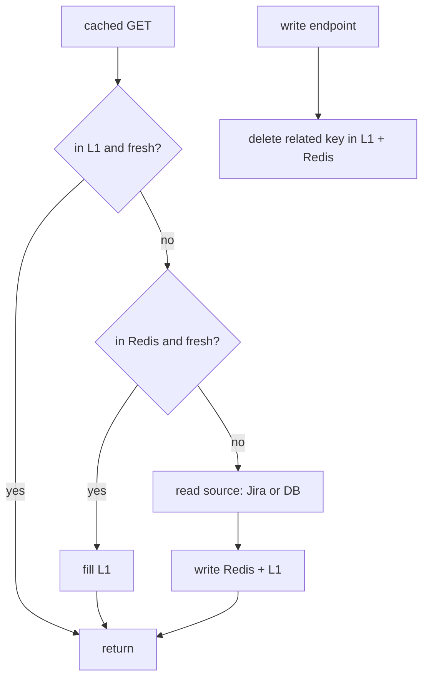
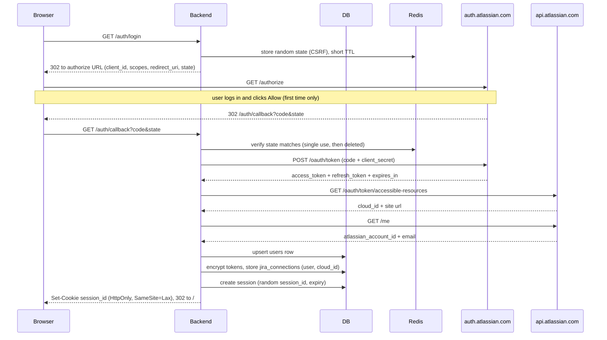
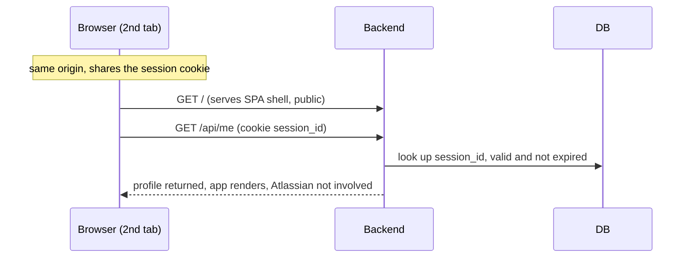
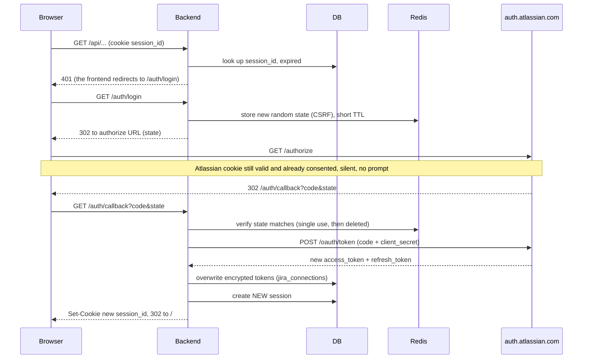
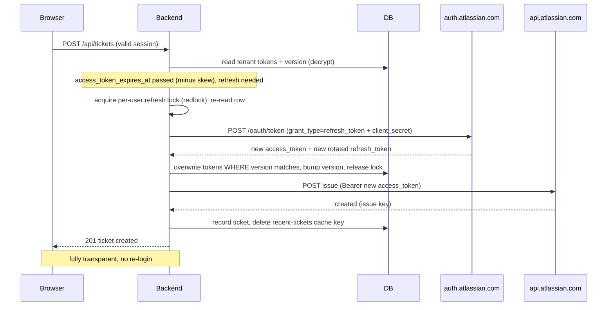
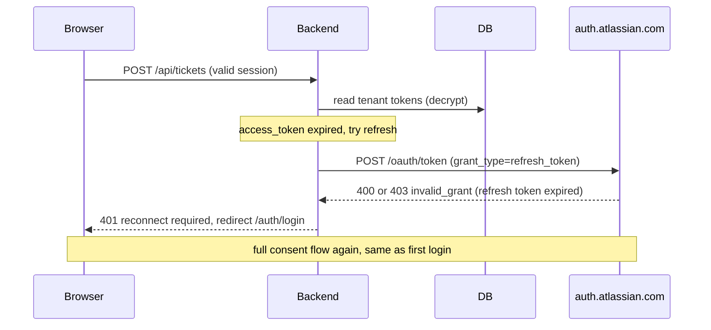
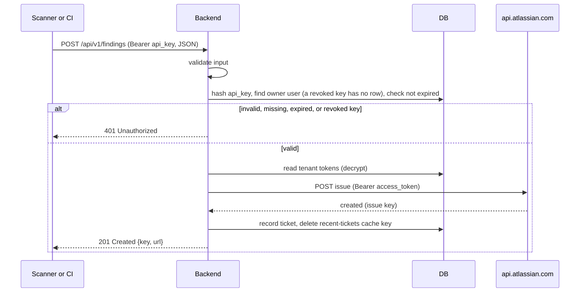
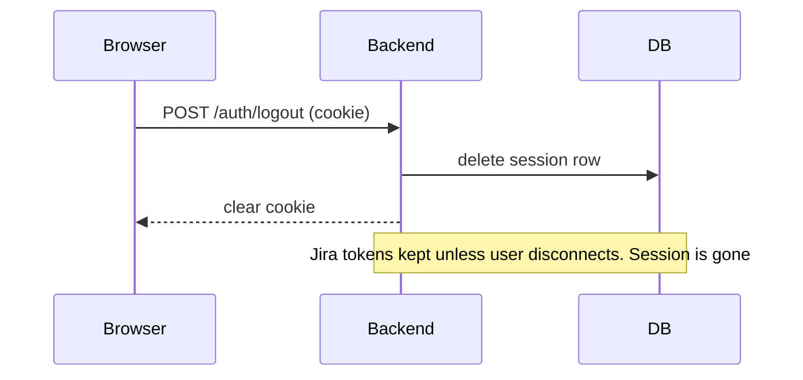
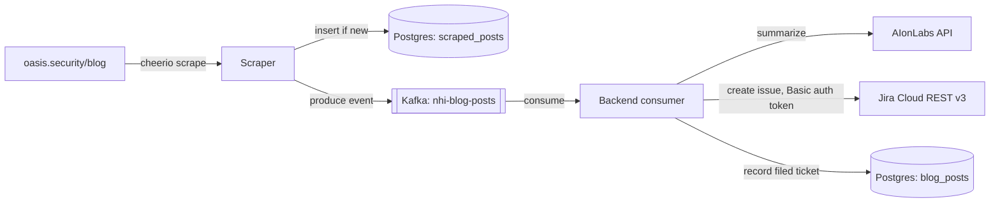

# IdentityHub - Backend Design Document

Proof of concept: report NHI (Non-Human Identity) findings as Jira tickets.
Multi-tenant, secure credential handling, plus a machine facing REST API.
This document covers the backend only. The UI is in
[docs/frontend-design.md](./frontend-design.md).

## Contents

- [Stack](#stack)
- [Code structure and conventions](#code-structure-and-conventions)
- [Tenancy model](#tenancy-model)
- [Two authentication paths](#two-authentication-paths)
- [Authentication and authorization](#authentication-and-authorization)
- [Backend for Frontend (BFF) rule](#backend-for-frontend-bff-rule)
- [Session management](#session-management)
- [Multi-tenant isolation](#multi-tenant-isolation)
- [Credential storage](#credential-storage)
- [API keys](#api-keys)
- [API surface](#api-surface)
- [Typed client and OpenAPI](#typed-client-and-openapi)
- [REST API for machine callers](#rest-api-for-machine-callers)
- [Jira client and rate limiting](#jira-client-and-rate-limiting)
- [Caching](#caching)
- [Observability (logs)](#observability-logs)
- [Data model](#data-model)
- [Run locally](#run-locally)
- [Login and token lifecycle flows](#login-and-token-lifecycle-flows)
  - [1. First login ever](#1-first-login-ever)
  - [2. Second login (second tab)](#2-second-login-second-tab-session-still-valid)
  - [3. Third login (backend session expired)](#3-third-login-backend-session-expired)
  - [4. Fourth login (Jira access token expired)](#4-fourth-login-jira-access-token-expired-session-still-valid)
  - [5. Fifth login (refresh token expired)](#5-fifth-login-refresh-token-expired-about-90-days)
  - [6. Machine caller (REST API)](#6-machine-caller-rest-api-no-session)
  - [Logout](#logout)
- [Bonus: NHI Blog Summary automation](#bonus-nhi-blog-summary-automation)
- [Scope decisions](#scope-decisions)
- [Assumptions and decisions](#assumptions-and-decisions)

## Stack

- Runtime: Node.js runs the backend (it strips TypeScript types natively, so the
  `.ts` sources run without a build step);
  Vite builds the frontend. Language: TypeScript.
- Backend: Hono, with `@hono/zod-openapi` so one Zod schema per route both
  validates the request and types the handler.
- Database: Postgres, accessed statelessly (see Multi-tenant isolation).
- Cache: Redis, plus a per-process in-memory tier. Redis also backs the per-user
  token-refresh lock (`@sesamecare-oss/redlock`, the maintained redlock fork).
- Database access: Kysely (type-safe query builder) with Kysely migrations.
- Jira client: generated from Atlassian's OpenAPI spec with `@hey-api/openapi-ts`
  (typed operations, no hand-written calls). Its transport is `ky`, which retries
  transient failures with jittered backoff (honoring `Retry-After` on 429/503).
- Messaging (bonus): Kafka via `kafkajs`. A separate scraper service produces
  blog-post events; the backend consumes them to summarize and file a Jira ticket.
- Scraping (bonus): the scraper service parses the Oasis blog's server-rendered
  HTML with `cheerio`. See NHI Blog Summary automation.
- TypeScript in strictest mode; oxlint and oxfmt in strict mode, no warnings.
- Transport: the server runs over plain HTTP locally on a single origin
  (`http://localhost:3000`). The session cookie is not marked `Secure` (a Secure
  cookie is never sent over HTTP). There is no TLS/self-signed-certificate code.
- Single origin: the backend also serves the Vite-built React SPA as static
  files from `frontend/dist` (via `@hono/node-server/serve-static`, with an
  `index.html` SPA fallback for client-side routes). Because the app and the API
  share one origin, the session cookie and the OAuth callback work with no proxy
  and no CORS.
- Frontend: minimal React SPA, built with Vite (`vite.config.ts` at the repo
  root, `root = frontend/src`, `outDir = frontend/dist`).
- One command runs everything (see Run locally).

## Code structure and conventions

Layered, one direction of dependency: `api -> service -> model / redis`. Nothing
skips a layer, and only the model and redis layers touch external stores.

The repository has two top-level app folders: `backend/` and `frontend/`.

```
backend/src/
  api/          HTTP routes, request parsing, response shaping (Hono). No business logic.
  services/     business logic. Orchestrates models, redis, and the Jira client.
  models/       the ONLY code that talks to Postgres (via Kysely).
  redis/        the ONLY code that talks to Redis.
  jira/         Atlassian client. A single `jira.ts` class is the ONLY code that
                calls Atlassian (token exchange, accessible-resources, identity,
                createmeta, issue create/read). Nothing else talks to Jira.
  ai/           AI client (bonus). A single class is the ONLY code that calls the
                AIonLabs API. Used by the blog-summary Kafka consumer.
  kafka/        Kafka client (bonus). The ONLY code that talks to Kafka. Hosts the
                blog-post consumer. See NHI Blog Summary automation.
  db/
    migrations/ Kysely migration files.
    schema.ts   typed database schema for Kysely.
  lib/          crypto (field-level encryption), logger.
  config.ts     the single env reader + typed, frozen config (next to index.ts).
  index.ts      entry point, wires the layers together.
```

Rules:

- `api` never imports `models` or `redis` directly; it calls `services`.
- `services` never run raw SQL or raw Redis commands; they call `models` and
  `redis` functions.
- `models` is the single choke point for Postgres. `redis` is the single choke
  point for Redis. This keeps data access and cache access auditable in one place.
- Database access uses Kysely only. No raw SQL strings in `api` or `services`.
- No database transactions unless we must. Use one only when several writes must
  succeed or fail together (for example creating a ticket row and its side
  effects atomically). Single-statement reads and writes run without a transaction.
- Stateless database access. Never set state on a connection or a transaction
  (no `SET`, `SET LOCAL`, `set_config`, session variables, or `SET ROLE`). Every
  query is self-contained and carries its own parameters, so any pooled
  connection is interchangeable and nothing leaks between requests.

Migrations and types: Kysely migrations live under `db/migrations`. The backend
launcher (`backend/scripts/start.ts`, a TypeScript program run by `npm run
backend` as `node --env-file .env backend/scripts/start.ts`) does, in order: (1)
apply migrations, (2) generate the Kysely schema types from the live database
with `kysely-codegen` into `db/schema.ts`, (3) run `vite build` to produce
`frontend/dist`, (4) start a background `vite build --watch` so frontend edits
rebuild automatically, then (5) start the server (its JSON logs piped through
`pino-pretty`). A single `AbortController` ties every child process to the
launcher, so `SIGINT`/`SIGTERM` (or the server exiting) tears the watcher and
pretty-printer down cleanly. So the types always match the migrated database, and
`db/schema.ts` is generated, never hand-edited. Schema changes are always a new
migration.

Connection pool: fixed size, `min = max = 10`. The pool holds a constant 10
Postgres connections, so behavior under load is predictable and there is no
ramp-up or idle-connection churn.

Strictness:

- TypeScript strictest: `strict` plus `noUncheckedIndexedAccess`,
  `exactOptionalPropertyTypes`, `noImplicitOverride`, `noFallthroughCasesInSwitch`.
- oxlint and oxfmt in strict mode; the build fails on any warning.

Configuration:

- A single `backend/src/config.ts` is the only file that reads the environment
  (`process.env` / `Bun.env`). It validates the whole environment with a Zod
  schema at startup (unknown vars ignored) and exposes a typed, deeply frozen
  config object (recursively frozen with `deep-freeze-es6`).
- No other file reads the environment directly. Everything imports from `config`.
- Every magic value lives in `config.ts`, never inline. Code references named
  config values, not literals.

Environment-derived values (validated by the Zod schema, no defaults; required):

| Name               | Description                              | Type   | Default  |
| ------------------ | ---------------------------------------- | ------ | -------- |
| JIRA_CLIENT_ID     | Atlassian OAuth app client id            | string | required |
| JIRA_CLIENT_SECRET | Atlassian OAuth app client secret        | string | required |
| OAUTH_CALLBACK_URL | OAuth redirect target                    | string | required |
| ENCRYPTION_KEY     | Symmetric key for field-level encryption | string | required |
| PORT               | Backend HTTP port                        | number | required |
| POSTGRES_USER      | Postgres username                        | string | required |
| POSTGRES_PASSWORD  | Postgres password                        | string | required |
| POSTGRES_DB        | Postgres database name                   | string | required |
| POSTGRES_HOST      | Postgres host                            | string | required |
| POSTGRES_PORT      | Postgres port                            | number | required |
| REDIS_PASSWORD     | Redis password                           | string | required |
| REDIS_HOST         | Redis host                               | string | required |
| REDIS_PORT         | Redis port                               | number | required |

The variables below are only needed by the bonus NHI Blog Summary feature (the
Kafka consumer inside the backend and the separate scraper service), not the web
API, so they live outside the required env schema and the server starts without
them. `config.ts` validates them as an all-or-none group with Zod and exposes
`config.blogSummary` (the structured config, or `undefined`): none set means the
feature is off (the web API runs alone); all set means it runs; some set is a
misconfiguration that fails validation at startup (fail fast), so a
half-configured deploy is caught immediately rather than silently half-working.
The Jira summary ticket is created with a hard-coded Atlassian API token (Basic
auth), independent of the per-user OAuth connections; it is a service account, not
a tenant.

| Name                     | Description                                                        | Type   | Default  |
| ------------------------ | ------------------------------------------------------------------ | ------ | -------- |
| KAFKA_BROKERS            | Comma-separated broker list (e.g. `localhost:9092`)                | string | optional |
| AIONLABS_API_KEY         | AIonLabs API key (secret; redacted in logs)                        | string | optional |
| JIRA_SUMMARY_BASE_URL    | Jira site base URL for Basic auth (e.g. `https://x.atlassian.net`) | string | optional |
| JIRA_SUMMARY_EMAIL       | Atlassian account email (Basic auth username)                      | string | optional |
| JIRA_SUMMARY_API_TOKEN   | Atlassian API token (secret; Basic auth password; redacted)        | string | optional |
| JIRA_SUMMARY_PROJECT_KEY | Target Jira project key for summary tickets                        | string | optional |

Constant values (hard-coded in `config.ts`, not from the environment):

| Name                                      | Description                             | Type          | Default                    |
| ----------------------------------------- | --------------------------------------- | ------------- | -------------------------- |
| constants.recentTicketsLimit              | Max tickets in the Recent Tickets view  | number        | 10                         |
| constants.cache.meAndProjectsTtlSeconds   | Cache TTL for /api/me and /api/projects | number (s)    | 300                        |
| constants.cache.recentTicketsTtlSeconds   | Cache TTL for recent tickets            | number (s)    | 10                         |
| constants.cache.assignableUsersTtlSeconds | Cache TTL for a project's assignees     | number (s)    | 60                         |
| constants.sessionTtlSeconds               | Session lifetime                        | number (s)    | 43200 (12h)                |
| constants.apiKeyMaxExpiryDays             | Upper bound on a requested key lifetime | number (days) | 3650                       |
| constants.validation.titleMaxLength       | Max title (Jira summary) length         | number        | 255                        |
| constants.validation.descriptionMaxLength | Max description length                  | number        | 32767                      |
| postgres.poolMin                          | Postgres pool min connections           | number        | 10                         |
| postgres.poolMax                          | Postgres pool max connections           | number        | 10                         |
| constants.kafka.topic                     | Blog-post topic name                    | string        | nhi-blog-posts             |
| constants.kafka.clientId                  | Kafka client id (backend consumer)      | string        | identityhub-backend        |
| constants.kafka.consumerGroupId           | Consumer group id for the backend       | string        | identityhub-blog-summary   |
| constants.blogSummary.titlePrefix         | Prefix on the summary ticket summary    | string        | "NHI Blog Summary: "       |
| constants.ai.baseUrl                      | AIonLabs API base URL                   | string        | https://api.aionlabs.ai/v1 |
| constants.ai.model                        | AIonLabs model id                       | string        | aion-labs/aion-2.0         |
| constants.ai.maxTokens                    | Max completion tokens for the summary   | number        | 500                        |
| constants.ai.temperature                  | Sampling temperature (factual summary)  | number        | 0.2                        |
| constants.ai.requestTimeoutMs             | Per-request timeout for the AI call     | number (ms)   | 30000                      |
| constants.ai.maxRetries                   | AI transport retries (ky, 429 only)     | number        | 4                          |

The scraper service has its own `config.ts` following the same pattern (single
env reader, Zod-validated, deeply frozen). See NHI Blog Summary automation for its
variables (`POSTGRES_*`, `KAFKA_BROKERS`, plus scrape-tuning constants).

Comment conventions:

- Every file begins with a short comment stating what the file does.
- Every important function has a JSDoc comment describing what it does, its
  parameters, and its return value.

## Tenancy model

One user equals one tenant equals one connected Jira site.

- Login uses Atlassian OAuth 2.0 (3LO) with Resource-level access, so a user's
  token is scoped to the single Jira site they pick during consent.
- Every row we own (`jira_connections`, `sessions`, `api_keys`, `tickets`) is
  keyed by `user_id`. There is no shared data between users.
- "Tenant" and "user" mean the same thing in this document. The word tenant is
  used when emphasizing isolation.
- Two different users may connect the same Jira site. They are still separate
  tenants: each has their own tokens and their own sessions. Recent Tickets is
  the one shared view: it lists app-created tickets for the selected project
  regardless of author, but each row is filtered through the acting user's own
  Jira token, so a user only ever sees issues they can actually open in Jira.

## Two authentication paths

| Caller                | Auth method    | Identifies user by |
| --------------------- | -------------- | ------------------ |
| Human (browser)       | Session cookie | session record     |
| Machine (scanner, CI) | API key        | hashed key lookup  |

Both paths end at the same place: look up the acting user's encrypted Jira
tokens, decrypt, call Jira scoped to that user.

## Authentication and authorization

Every endpoint is authenticated and authorized. There is no endpoint that reads
or writes tenant data without both checks.

Authentication (who is calling):

- Browser routes require a valid session (session cookie). Missing or invalid
  -> 401.
- Machine routes (`/api/v1/*`) require a valid, non-expired, non-revoked API key
  -> 401 otherwise.
- The only unauthenticated routes carry no tenant data: `GET /` (the SPA shell,
  served before JS loads) and the login routes themselves (`/auth/login`,
  `/auth/callback`, and `POST /auth/logout`).

Authorization (are they allowed this object):

- Every data access is object-level scoped to the acting `user_id`. Establishing
  who the user is (authentication) is never enough; the specific object must
  belong to them.
- Id-based routes (`DELETE /api/api-keys/:id`, reading a ticket by key, etc.)
  must filter by `user_id` in the same query, never by id alone. This prevents
  IDOR, where a user names another tenant's id in the URL.
- On an ownership miss we return 404, not 403, so we do not reveal that an object
  with that id exists for another tenant.
- Enforced at the `models` choke point: every model function that returns
  tenant-owned rows takes the acting `user_id` and includes it in the query, so
  authorization cannot be forgotten in a handler. The one exception is the Recent
  Tickets read, which is project-scoped by design (a shared per-project view);
  there, authorization is enforced instead by resolving each issue live through
  the acting user's Jira token, so an issue the user cannot see in Jira is
  dropped from the list. Jira remains the source of truth for issue visibility.

## Backend for Frontend (BFF) rule

The browser never holds a Jira token. The client secret and all Jira tokens
live only on the backend. The browser holds only an opaque session cookie.

## Session management

- `session_id`: random opaque value. Not a JWT, not derived from the Jira token.
- Stored server side: `session_id -> user_id, expires_at`.
- Cookie flags: `HttpOnly` (JS cannot read it) and `SameSite=Lax` (not sent on
  cross site requests, blocks CSRF). Not `Secure`: the POC is served over plain
  HTTP and a Secure cookie is never sent over HTTP. In production over HTTPS this
  would be `Secure`.
- Rolling (sliding) session. TTL is 12 hours of inactivity. On each authenticated
  request the backend extends `expires_at` to now + 12h, so an active user stays
  logged in and only 12 hours of no activity expires the session.
- Rotated on every login. Revocable by deleting the row.
- Session expiry is ours and independent of Jira token expiry.

Session renewal alternatives considered:

| Approach                                                                    | How a returning user stays logged in                                                                   | Decision                                                                            |
| --------------------------------------------------------------------------- | ------------------------------------------------------------------------------------------------------ | ----------------------------------------------------------------------------------- |
| Rolling session (extend `expires_at` by the TTL on each request)            | Active use keeps the same session alive; only inactivity expires it                                    | Chosen                                                                              |
| Fixed-TTL session, re-OAuth on expiry                                       | Session expires at a hard 12h; expiry triggers a silent OAuth re-login that also mints new Jira tokens | Not chosen (re-runs OAuth and mints tokens unnecessarily)                           |
| Persistent-login token (rotating refresh-token pattern for our own session) | A separate long-lived token renews the session locally, no OAuth, with reuse detection                 | Not doing (production upgrade; adds a second credential, rotation, reuse detection) |
| JWT session (claims in the browser)                                         | Stateless validation, no lookup                                                                        | Not chosen (weakens revocation, puts claims in the browser)                         |

Chosen: rolling session. It gives "come back later and still be logged in" for
active users with no extra credential, and expiry is enforced server-side by
comparing `expires_at` to now, never by trusting the cookie.

## Multi-tenant isolation

Strict scoping stops one tenant from reading another tenant's rows: every query
filters by the authenticated `user_id`.

- It is enforced in one place: the `models` layer is the single choke point for
  Postgres, and every model function takes the acting `user_id` and includes it
  in the query. Nothing else touches the database, so scoping is auditable in one
  directory and covered by tests.
- This is fully stateless: the `user_id` is a query parameter, not connection or
  transaction state, which satisfies the stateless database rule.
- Row-Level Security is not used. Per-user RLS requires setting connection or
  transaction state (`SET`/`set_config`), which the stateless rule forbids. The
  models choke point plus tests is the stateless equivalent.

Field-level encryption (see Credential storage) is a separate, defense-in-depth
measure. It protects credentials at rest against a stolen database. It does not
by itself isolate row reads between tenants, so it is not counted as an
isolation layer here.

Encryption key: one symmetric app key from an environment variable for the POC.

Isolation and encryption techniques, and where we draw the line:

| Technique                                                                             | What it stops                                                   | Decision                                                                          |
| ------------------------------------------------------------------------------------- | --------------------------------------------------------------- | --------------------------------------------------------------------------------- |
| Strict scoping (every query filters by `user_id`, enforced at the models choke point) | Cross-tenant reads via queries                                  | Chosen                                                                            |
| Row-Level Security (Postgres policies)                                                | Cross-tenant reads even if a query forgets to scope             | Not doing (needs connection/transaction state; conflicts with the stateless rule) |
| Field-level encryption (encrypt tokens and API keys at rest)                          | A stolen database file or dump                                  | Chosen                                                                            |
| Single app encryption key (from env)                                                  | Same as field-level, one shared key                             | Chosen for the POC                                                                |
| Per-tenant keys (a key per tenant)                                                    | A bug returning another tenant's row (renders it undecryptable) | Not doing (future)                                                                |
| Envelope encryption (data keys wrapped by a master key)                               | Managing many keys safely                                       | Not doing (future)                                                                |
| KMS (hardened master-key service)                                                     | The master key itself being stolen                              | Not doing (future)                                                                |

The chosen set is standard for a POC: strict scoping at the models choke point
plus encryption of the sensitive columns. The rest is production hardening for
highly sensitive data,
which a real security product would move toward but which adds key-management
complexity beyond this exercise.

## Credential storage

- Jira `access_token` and `refresh_token`: encrypted (field-level) at rest.
- API keys: stored as a hash only (like a password). The raw key is shown once
  at creation and never again.
- `refresh_token` rotates on each refresh; the stored value is overwritten.
- Refresh is two-layered:
  - Proactive: before calling Jira, the backend checks `access_token_expires_at`
    (minus a 30s skew, `constants.accessTokenRefreshSkewSeconds`) and refreshes
    if the token is at or past that point, rather than waiting for a 401.
  - Reactive: if Jira still rejects a call with 401 (clock skew, or a token
    invalidated server-side before its stored expiry), `JiraAccess.withConnection`
    refreshes once and retries the operation a single time.
- Single-flight refresh: refresh runs under a per-user distributed lock
  (`redlock` over Redis, keyed `jira_refresh_lock:{user_id}`). After acquiring the
  lock the row is re-read, so if another request or pod already rotated the token
  we reuse theirs instead of spending the (now single-use, rotated) refresh token
  again and tripping Atlassian's reuse detection.
- Optimistic-concurrency guard: `jira_connections.version` is bumped on every
  token write, and the refresh write is conditional on the version read. Even if
  the lock is ever bypassed (Redis failover, a lost lock extension), a slow writer
  cannot clobber a newer, already-rotated token pair; it detects the conflict and
  reuses the stored tokens.
- A refresh that fails with 400 or 403 (`invalid_grant`) means the refresh token
  is expired or already rotated away; the backend surfaces a 401 reconnect.

## API keys

API keys are how machines authenticate. They are created by a human, then
configured into a scanner or CI system.

- Creation: a logged-in user calls `POST /api/api-keys` with `{ name,
expiresInDays }` (`name` is a human label for the service account, for example
  `prod-scanner`; `expiresInDays` is how long the key stays valid, bounded by
  `constants.apiKeyMaxExpiryDays` = 3650). The UI offers presets (1 day, 30 days,
  12 months) or a custom number of days. The backend generates a random key and
  returns it once, along with `id`, `name`, `createdAt`, and `expiresAt`. It
  stores only the key hash, bound to that user.
- Listing: `GET /api/api-keys` returns metadata only (`id`, `name`, `createdAt`,
  `lastUsedAt`, `expiresAt`), never the raw key.
- Use: the machine sends `Authorization: Bearer <api_key>`. The backend hashes
  the presented key, finds the owning user, and acts as that user.
- Expiry: each key has `expires_at` (from the requested `expiresInDays`). The
  machine auth path rejects an expired or revoked key with 401.
- Rotation without downtime: create a new key, update the machine to use it,
  then revoke the old one. A user may hold more than one active key.
- Revocation: `DELETE /api/api-keys/:id` deletes the row; the key stops working
  immediately. A revoked key no longer matches any stored hash, so it is
  rejected as invalid.

An API key's lifetime is independent of the user's Jira OAuth connection. The key
only identifies which user a machine call acts as; the actual Jira access uses
that user's stored OAuth tokens. Atlassian refresh tokens rotate on each refresh
and lapse after roughly 90 days of inactivity, so if a key sits unused past that
window (and no human logs in), the refresh token expires. A machine call with a
still-valid API key then fails with 401 "Your Jira connection needs to be
re-established" until a human re-authenticates through the browser OAuth flow,
which mints a fresh refresh token. The API key itself is not invalidated.

## API surface

Two route groups, versioned differently on purpose.

Public machine API, versioned because it is an external contract:

| Method and path       | Purpose                                     |
| --------------------- | ------------------------------------------- |
| POST /api/v1/findings | Create an NHI finding ticket (API key auth) |

Internal browser API, unversioned because it ships with the frontend:

| Method and path                  | Purpose                                                                              |
| -------------------------------- | ------------------------------------------------------------------------------------ |
| GET /                            | Serve the SPA shell (public, sent before JS loads)                                   |
| GET /auth/login                  | Start OAuth login                                                                    |
| GET /auth/callback               | OAuth redirect target                                                                |
| POST /auth/logout                | End the session                                                                      |
| GET /api/me                      | Current user profile and connected Jira site                                         |
| GET /api/projects                | List creatable projects with their issue types and required fields (from createmeta) |
| GET /api/projects/:key/assignees | Users who can be assigned issues in the project (for the assignee picker)            |
| POST /api/tickets                | Create a ticket from the UI                                                          |
| GET /api/tickets?projectKey=...  | Recent tickets for a project (max 10)                                                |
| GET /api/api-keys                | List the user's API keys (metadata only)                                             |
| POST /api/api-keys               | Create an API key (returned once)                                                    |
| DELETE /api/api-keys/:id         | Revoke an API key                                                                    |

Operational, unauthenticated:

| Method and path   | Purpose                                     |
| ----------------- | ------------------------------------------- |
| GET /openapi.json | OpenAPI spec (generated from route schemas) |
| GET /docs         | Swagger UI                                  |

### Error and retry policy (our endpoints)

Retries are a backend concern; clients do not retry. There are three layers,
all server-side:

1. **Endpoint layer** (`lib/retry.ts`, `Retry.idempotent`): the idempotent
   **read** endpoints retry the whole operation on a transient failure — an
   upstream Jira 5xx, or a Redis/lock blip (redlock `ExecutionError`) — up to
   `constants.apiRetry.attempts` = 3, with full-jitter exponential backoff.
   Terminal errors (400/404/401, Jira 4xx) are rethrown at once. **Creates are
   never wrapped** (non-idempotent; a retry could duplicate the issue).
2. **Auth layer** (`JiraAccess.withConnection`): a Jira 401 refreshes the token
   once (under the per-user lock) and retries the call once.
3. **Transport layer** (`ky`, see
   [Retry and recoverability](#retry-and-recoverability-outbound-jiraatlassian-calls)):
   transient 429/503/5xx on idempotent GETs and 429 on the create POST.

A response returned to the caller is **final** — the backend already exhausted
the retries that make sense, so there is nothing useful for a client to re-drive.

Every failure is mapped to one status by the central handler
(`api/error-handler.ts`):

- **401 (two distinct causes)**:
  - _Session 401_ — no/expired session cookie; the `sessionOnly` middleware
    rejects before the handler runs. Fix: log in again (any authenticated
    endpoint can return this).
  - _Reconnect 401_ — the Jira connection itself is unusable: no connection
    (`NotConnectedError`) or the refresh token is dead (`RefreshTokenExpiredError`,
    from a 400/403 `invalid_grant`). Message: "Your Jira connection needs to be
    re-established." Fix: re-run the OAuth consent flow (`/auth/login`). Only
    endpoints that actually use the Jira token can return this. A retry cannot
    fix either 401 — hence "401 -> reconnect" in the table.
- **502**: the backend called Jira, retried the configured number of times, and
  it still failed. Terminal for this request.
- **400 / 404**: bad input, missing permission, or the resource is gone.
- **500**: unexpected. A create is never blindly re-issued on 5xx server-side
  (non-idempotent; it may already have been applied).

"Retried in backend" is the internal retry applied while handling the call; the
client just receives the final status.

| Method and path                  | Statuses                | Retried in backend (internal)                        | Client outcome (no client retry)                                   |
| -------------------------------- | ----------------------- | ---------------------------------------------------- | ------------------------------------------------------------------ |
| GET /api/me                      | 200, 401, 500           | endpoint x3 (transient only; DB read, no Jira)       | 401 session -> log in                                              |
| GET /api/projects                | 200, 401, 502, 500      | endpoint x3, then Jira GET x4 + 401 refresh          | 401 session -> log in; 401 -> reconnect; 502/500 shown             |
| GET /api/projects/:key/assignees | 200, 400, 401, 502, 500 | endpoint x3, then Jira GET x4 + 401 refresh          | 400 (bad project / no "Browse users" perm); 401 -> reconnect       |
| GET /api/tickets?projectKey      | 200, 401, 502, 500      | endpoint x3, then Jira GET x4 + 401 refresh          | 401 -> reconnect; 502/500 shown                                    |
| POST /api/tickets                | 201, 400, 401, 502, 500 | create POST: 429 x4, 401 refresh (no endpoint retry) | 400 field/validation; 401 -> reconnect; 502 shown (not re-created) |
| POST /api/v1/findings            | 201, 400, 401, 502, 500 | create POST: 429 x4, 401 refresh (no endpoint retry) | same as POST /api/tickets                                          |
| GET /api/api-keys                | 200, 401, 500           | none (DB only)                                       | 401 session -> log in                                              |
| POST /api/api-keys               | 201, 400, 401, 500      | none (DB only)                                       | 400 validation; 401 session                                        |
| DELETE /api/api-keys/:id         | 200, 404, 401, 500      | none (DB only)                                       | 404 (already gone); 401 session                                    |
| GET /auth/login                  | 302                     | n/a                                                  | redirect to Atlassian authorize                                    |
| GET /auth/callback               | 302                     | n/a                                                  | redirect to / or /login?error (invalid/expired state)              |
| POST /auth/logout                | 200                     | n/a                                                  | -                                                                  |

## Typed client and OpenAPI

### Typed frontend client (no codegen)

- Routes are defined with `@hono/zod-openapi`, so each has Zod input and output
  schemas.
- The backend exports its app type: `export type AppType = typeof app`.
- The frontend imports that type and builds a client with Hono RPC:
  `hc<AppType>(baseUrl)` from `hono/client`. Request and response are fully typed
  end to end, with no generated types and no generated client. It is a plain
  type import across the monorepo, so the types cannot drift from the routes.
- The client sends the session cookie with each request (credentials included).

### Input validation

- Every request input (path params, query, body) is validated by schema at the
  route boundary, never hand-parsed.
- Because routes are declared with `@hono/zod-openapi`, one Zod schema per route
  validates the request, types it, and generates its OpenAPI entry. Validation,
  types, and docs come from the same source.
- Invalid input returns 400 with a message naming the offending field.

### OpenAPI and Swagger

- The Zod schemas on each route generate the OpenAPI document automatically.
- `GET /openapi.json` serves the spec; `GET /docs` serves Swagger UI via
  `@hono/swagger-ui`. No hand-written OpenAPI.

## REST API for machine callers

- `POST /api/v1/findings`, REST conventions.
- Auth: `Authorization: Bearer <api_key>`.
- Validates input against the project's createmeta: projectKey required, title
  required (non-empty, max `titleMaxLength` 255), description required (non-empty,
  max `descriptionMaxLength`), plus any field the project marks required. Curated
  optional fields (priority, labels, assignee, due date, components) are accepted
  when provided and validated against their `allowedValues`. The same length
  limits are enforced here as in the UI, from the same config values, so a
  bypassed or malicious client cannot exceed them.
- Field value shaping: each curated/required field is converted to the shape Jira
  expects before create. A user field (assignee) is sent as `{ accountId }`;
  priority/option fields as `{ id }`; date fields as a `yyyy-MM-dd` string; the
  `labels` array as `string[]`; other array fields as `[{ id }]`.
- Status codes: 201 created; 400 for bad input, a missing required field, or a
  field value Jira rejects (see error surfacing below); 401 bad/missing/expired
  key; 404 project not found; 502 only for a genuine Jira upstream failure.
- Returns the created issue key and url.

Error surfacing: when Jira returns a 4xx (it received the request but rejected
our data, for example an invalid field value), the backend extracts Jira's own
reason from its `{ errorMessages, errors: { <field>: <reason> } }` body and
returns it as a 400 so the caller can fix the input. Only true upstream failures
(5xx or network errors) stay a 502 "We couldn't reach Jira". Every error response
has the same body shape, `{ message }`.

## Jira client and rate limiting

The Jira REST client is generated, not hand-written, and rate-limit retry is
handled by the transport, not by us.

Single choke point: all Atlassian traffic goes through one class,
`backend/src/jira/jira.ts` (`JiraClient`). Both the generated REST operations and
the few hand-written OAuth calls are wrapped as methods on this one class, so
every Jira call, its auth, and its transport are configured in a single
auditable place. No other file calls Atlassian.

Generated client:

- Generated from Atlassian's Jira Cloud OpenAPI v3 spec with
  `@hey-api/openapi-ts` (already a repo dependency). The spec is vendored to
  `devex/configs/jira-openapi-v3.json`; the generation config
  (`devex/configs/jira-openapi-ts.config.mjs`) filters it to only the operations
  we call, and the output lands in `devex/generated/jira` (gitignored, produced
  by `npm run codegen`, mirroring the existing rauthy client). This gives typed
  operations for the endpoints we use (per-project createmeta
  `getCreateIssueMetaIssueTypes` and `getCreateIssueMetaIssueTypeId`,
  `searchProjects`, `createIssue`, `getIssue`), with no hand-written request code
  or response types. The older bulk createmeta is deprecated and not used.
- Direct `fetch` is banned repo-wide by lint; the generated client's transport is
  overridden with `ky` (see Rate limiting). We do not write fetch calls or Jira
  types by hand.
- Not covered by the filtered generated client: the OAuth token exchange
  (`auth.atlassian.com/oauth/token`), `accessible-resources`, the `/me` identity
  call (both on `api.atlassian.com`), and the assignable-users search
  (`/rest/api/3/user/assignable/search?project=<key>`, capped at
  `constants.jira.assignableUsersPageSize` = 100). Those are small hand-written
  calls (also `ky`) that live as methods on the same `JiraClient`.

Rate limiting and transport retry:

- Jira Cloud returns HTTP 429 when a rate limit is exceeded (and some 503s),
  usually with a `Retry-After` header. We do not hand-roll retry logic.
- The generated client uses `ky` as its transport. Retries are capped at
  `constants.jira.maxRetries` = 4 (5 attempts total) with jittered backoff, and
  honor `Retry-After` on 429 and 503.
- GETs are idempotent, so the GET transport retries the full transient set:
  408, 429, 500, 502, 503, 504.
- The create-issue `POST` retries on 429 only: a rate-limited request was
  rejected before processing, so retrying cannot create a duplicate. A `POST` is
  never retried on 5xx or network errors, where Jira may already have processed
  the create, matching Atlassian's guidance. (The two token `POST`s to
  `auth.atlassian.com` are also 429-only, for the same reason.)
- The bulk issue read (`POST /issue/bulkfetch`, used by Recent Tickets) is a
  `POST` by HTTP method but a pure read, so it uses a third transport that
  retries the full idempotent set (408/429/500/502/503/504) like a GET. Re-reading
  is always safe, so there is no duplicate-write risk to guard against here.
- If retries are exhausted, the Jira call fails and the caller gets 502 (or the
  create endpoint surfaces a clear "Jira is rate limiting, try again" message).
- Retries and rate-limit responses are logged, so 429s and backoff are visible in
  the structured logs.

### Retry and recoverability (outbound Jira/Atlassian calls)

Two independent retry layers, plus a deliberate split between recoverable and
terminal errors so a retry is never spent on something it cannot fix (bad input,
missing permission, a dead refresh token):

- Transport (`ky`, above): transient rate-limit/unavailability/5xx. Up to 4
  retries.
- Auth (`JiraAccess.withConnection`): a 401 means the access token was rejected;
  refresh once (under the per-user lock) and retry the call a single time. A
  second 401 is surfaced.

`op` = the `JiraClient` method. Recoverable errors are auto-retried; terminal
errors are surfaced (mapped to a client status by `api/error-handler.ts`).

| op (method)                       | HTTP           | Recoverable -> retry                                | Terminal -> surfaced                                                                                        |
| --------------------------------- | -------------- | --------------------------------------------------- | ----------------------------------------------------------------------------------------------------------- |
| `exchangeCode` (login)            | POST token     | 429 -> transport x4                                 | 400/403 `invalid_grant` -> login fails; 5xx/network -> 502 (no POST retry)                                  |
| `exchangeRefreshToken`            | POST token     | 429 -> transport x4                                 | 400/403 `invalid_grant` -> `RefreshTokenExpiredError` -> 401 reconnect; 5xx/network -> 502                  |
| `listAccessibleResources` (login) | GET            | 429/503/5xx -> transport x4                         | 401/4xx -> login fails                                                                                      |
| `getIdentity` (login)             | GET            | 429/503/5xx -> transport x4                         | 401/4xx -> login fails                                                                                      |
| `getAssignableUsers`              | GET            | 429/503/5xx -> transport x4; 401 -> auth refresh x1 | 400 (bad project / no "Browse users" permission), 403 -> surfaced                                           |
| `searchCreatableProjects`         | GET            | 429/503/5xx -> transport x4; 401 -> auth refresh x1 | 403/4xx -> surfaced                                                                                         |
| `getIssueTypes`                   | GET            | 429/503/5xx -> transport x4; 401 -> auth refresh x1 | 4xx -> surfaced                                                                                             |
| `getIssueTypeFields`              | GET            | 429/503/5xx -> transport x4; 401 -> auth refresh x1 | 4xx -> surfaced                                                                                             |
| `createIssue`                     | POST           | 429 -> transport x4; 401 -> auth refresh x1         | 400 field errors -> surfaced with per-field detail; 5xx/network -> 502 (no POST retry, may have created)    |
| `getIssuesDetails` (bulk)         | POST bulkfetch | 429/503/5xx -> transport x4; 401 -> auth refresh x1 | issues not visible/deleted are omitted from the response (row dropped, not an error); other 4xx -> surfaced |

## Caching

Every cached read uses the same two-tier cache. Each endpoint has its own key,
TTL, and invalidation rule.

- L1, in memory: a per-process map, fastest, not shared across instances.
- L2, Redis: shared across all backend instances, survives a single process.
- Every cache key includes `{user_id}`, so one tenant is never served another
  tenant's cached data.

### Per-endpoint cache policy

| Endpoint                         | Cache key                                  | TTL  | Invalidated by                          |
| -------------------------------- | ------------------------------------------ | ---- | --------------------------------------- |
| GET /api/me                      | `me:{user_id}`                             | 300s | logout, reconnect                       |
| GET /api/projects                | `projects:{user_id}`                       | 300s | reconnect (new Jira connection)         |
| GET /api/projects/:key/assignees | `assignable_users:{user_id}:{project_key}` | 60s  | TTL only (short, so new users show up)  |
| GET /api/tickets?projectKey      | `recent_tickets:{user_id}:{project_key}`   | 10s  | ticket create for that user and project |

`GET /api/api-keys` is not cached: key lists change on explicit user action and
must always reflect the current state.

Write endpoints are never cached and invalidate the related key:

- POST /api/tickets and POST /api/v1/findings delete
  `recent_tickets:{user_id}:{project_key}`.
- Auth routes are never cached.

### Auth runs before the cache

The cache is never consulted for an unauthenticated or invalid request. The auth
middleware validates the `session_id` (exists, not expired, not revoked) and
resolves the `user_id` before any handler runs. An invalid session returns 401
and never reaches the cache. Because every cache key is built from that validated
`user_id`, the key cannot even be computed without a valid session, so a revoked
or expired user can never be served cached data, and no user can reach another
user's key.

### Read and write path (applies to every cached read)

Read path:

1. Look in L1. If present and not expired, return it.
2. Else look in Redis. If present, populate L1 and return it.
3. Else read from the source (the `users` and `jira_connections` tables for me;
   Jira for projects; the `tickets` table for recent-ticket references plus a
   live Jira fetch for their current titles), then write the result to Redis and
   L1, and return it.

Write path: on a write for `user_id` (and `project_key` where relevant), delete
the related key in both L1 and Redis so the change appears immediately instead
of waiting for the TTL.



## Observability (logs)

Structured logs are the observability surface for this POC. Metrics
(Prometheus/OpenTelemetry) are intentionally out of scope for a home assignment;
they are the obvious production follow-up but add wiring that does not change the
functional result here.

### Logs

- Structured JSON logs via `pino`. One logger, injected through the layers.
- The request middleware attaches that logger to the request context and logs a
  one-line summary per request. There is no `request_id` (no `x-request-id`
  header, no per-request child logger); it was dropped as unnecessary for the POC.
- Standard fields on request logs: `method`, `route`, `status`, `duration_ms`,
  and `user_id` when authenticated.
- Secrets are never logged: tokens, API keys, cookies, and the client secret are
  redacted by a pino redaction list.
- Log levels: `error` for handled failures and 5xx, `warn` for 4xx and auth
  rejections, `info` for lifecycle and request summaries, `debug` for detail
  behind a flag.

## Data model

```
users(id, atlassian_account_id, email, created_at)

jira_connections(
  user_id PK, cloud_id, site_url,
  enc_access_token, enc_refresh_token, access_token_expires_at,
  version   -- optimistic-concurrency counter, bumped on every token write
)   -- one connected Jira site per user (the tenant)

sessions(session_id, user_id, expires_at)

api_keys(id, user_id, name, key_hash, created_at, last_used_at, expires_at)

tickets(id, user_id, project_key, jira_issue_key, created_at)

scraped_posts(id, post_url UNIQUE, title, discovered_at)
    -- bonus: the SCRAPER's own dedup ledger. Only the scraper touches it.

blog_posts(
  id, post_url UNIQUE, title, discovered_at,
  summary, jira_issue_key, ticketed_at
)   -- bonus: the BACKEND consumer's record of filed summary tickets. Only the
    -- backend touches it.
```

Notes:

- `jira_connections` holds the per-user Jira site and its encrypted tokens, so
  `user_id`, `cloud_id`, and the tokens live together. This is the tenant record.
- `tickets` stores only a reference to each issue we created (`jira_issue_key`
  plus the immutable `created_at`), never the issue content. Content like the
  title can be edited in the Jira UI, so Recent Tickets fetches the current title
  live from Jira by key. Our table decides which issues are candidates and their
  order; Jira provides the up-to-date display. The row still carries `user_id`
  (who created it), but the Recent Tickets read is project-scoped: it lists every
  app-created ticket for the selected project, then filters them through the
  acting user's Jira token so only issues that user can open are returned.
  Tickets created directly in Jira (not through the app) are not shown. Each
  candidate batch is resolved with a single bulk call (`POST /issue/bulkfetch`,
  up to 100 keys), not one `GET /issue/{key}` per row: Jira omits issues the
  token cannot see (deleted or permission-denied) from the response, so the same
  call both fetches live titles and applies the visibility filter. Because that
  filter runs after the database read, the read pages candidates newest-first and
  keeps pulling batches until it has 10 visible rows (or runs out / hits the scan
  cap), rather than a single `LIMIT 10` the filter could shrink below 10.
- The bonus feature uses TWO separate tables so the scraper and the backend never
  share a table (or a migration history). `scraped_posts` is the scraper's dedup
  ledger: it inserts a row on discovery (`post_url` unique, so a post is recorded
  once even if two cycles overlap) and only publishes a Kafka message when the
  insert actually created a row. `blog_posts` is the backend consumer's record: it
  inserts a row only after summarizing and filing the Jira ticket, so a row
  existing means the post is already filed, which makes the consumer idempotent
  under Kafka's at-least-once delivery. Neither table has a `user_id`: summary
  tickets are filed by a service account (a hard-coded Jira API token), not a
  tenant. The scraper owns `scraped_posts` end to end, including its own migration
  tracked in a separate `scraper_kysely_migration` table (see the NHI Blog Summary
  section), so the two services' migrations never collide.

### Indexes

Every index exists to serve a specific read; none are speculative. Primary
keys and unique constraints are omitted from the table below (they index
automatically).

| Index                        | Columns                       | Serves                                                                                        |
| ---------------------------- | ----------------------------- | --------------------------------------------------------------------------------------------- |
| `users` PK / unique          | `id` / `atlassian_account_id` | user by id; login upsert on `onConflict(atlassian_account_id)`                                |
| `jira_connections` PK        | `user_id`                     | the tenant record lookup and version-checked token write                                      |
| `sessions` PK                | `session_id`                  | per-request session validation (point lookup; `expires_at` is checked on the found row)       |
| `sessions_user_id_idx`       | `user_id`                     | revoke-all / cascade delete of a user's sessions                                              |
| `api_keys` unique            | `key_hash`                    | API-key auth hot path (`where key_hash = ?`)                                                  |
| `api_keys_user_list_idx`     | `user_id, created_at`         | the key-management list (`where user_id = ? order by created_at desc`)                        |
| `tickets_project_recent_idx` | `project_key, created_at, id` | Recent Tickets: filter by `project_key`, page newest-first with the `(created_at, id)` keyset |

Notes:

- `tickets_project_recent_idx` replaced an earlier `(user_id, project_key,
created_at)` index. Recent Tickets is project-scoped (it lists every app
  user's tickets for the selected project, then filters by the acting user's
  Jira visibility), so it never filters on `user_id`; a `user_id`-led index
  could not serve the read. The column order matches the query exactly:
  `project_key` equality, then the `(created_at, id)` keyset. The index is
  plain ascending; Postgres walks it backward to satisfy the
  `ORDER BY created_at DESC, id DESC` paging.
- No `expires_at` index on `sessions` or `api_keys`: expiry is enforced inline
  at read time (`expires_at > now`) and rows are deleted individually by key,
  never swept in a batch, so there is no range scan to support. If a periodic
  cleanup job is ever added, a partial or `expires_at` index would pay off then.

---

## Login and token lifecycle flows

### 1. First login ever



### 2. Second login (second tab, session still valid)



### 3. Third login (backend session expired)



### 4. Fourth login (Jira access token expired, session still valid)



### 5. Fifth login (refresh token expired, about 90 days)



### 6. Machine caller (REST API, no session)



### Logout



---

## Run locally

One command starts the backend, frontend, Postgres, and Redis. Required
configuration lives in `.env` at the repo root, which is gitignored.

| Variable           | Purpose                                     |
| ------------------ | ------------------------------------------- |
| JIRA_CLIENT_ID     | Atlassian OAuth app client id               |
| JIRA_CLIENT_SECRET | Atlassian OAuth app client secret           |
| OAUTH_CALLBACK_URL | `http://localhost:3000/auth/callback`       |
| ENCRYPTION_KEY     | Symmetric key for field-level encryption    |
| POSTGRES_USER      | Postgres username                           |
| POSTGRES_PASSWORD  | Postgres password                           |
| POSTGRES_DB        | Postgres database name                      |
| POSTGRES_HOST      | Postgres host                               |
| POSTGRES_PORT      | Postgres port                               |
| REDIS_PASSWORD     | Redis password                              |
| REDIS_HOST         | Redis host                                  |
| REDIS_PORT         | Redis port                                  |
| PORT               | Backend port; 3000 matches the callback URL |

Postgres and Redis run from `devex/docker-compose.yml`, which reads these same
variables. `config.ts` is the only code that reads them.

The OAuth app must be registered in the Atlassian Developer Console with the
callback URL above and the scopes listed in Assumptions.

The bonus NHI Blog Summary feature adds optional variables (`KAFKA_BROKERS`,
`AIONLABS_API_KEY`, `JIRA_SUMMARY_BASE_URL`, `JIRA_SUMMARY_EMAIL`,
`JIRA_SUMMARY_API_TOKEN`, `JIRA_SUMMARY_PROJECT_KEY`); the web API ignores them and
the in-process Kafka consumer uses them. Kafka runs from the same
`devex/docker-compose.yml` (`npm run docker-compose:up` starts Postgres, Redis,
and Kafka). The scraper service is a second process, started with `npm run
scraper` (`node --env-file .env scraper/src/index.ts`); it needs only
`POSTGRES_*` and `KAFKA_BROKERS`. So end to end, locally: bring up the compose
services, run `npm run backend` (serves the app and runs the consumer), and run
`npm run scraper` in another shell. See the NHI Blog Summary section.

---

## Bonus: NHI Blog Summary automation

An optional, headless feature (no UI, per the brief). A separate scraper service
polls the Oasis Security blog, records any new post, and emits a Kafka event; the
backend consumes that event, summarizes the post with AI, and files a Jira ticket.
Two decoupled services communicate only through Kafka and a shared Postgres table,
which is exactly why this is a good showcase: scraping cadence and ticketing are
independent, the queue absorbs bursts and retries, and each side scales alone.

### Topology



1. The scraper fetches the blog listing and parses each post's title and URL.
2. For each post it checks its own `scraped_posts` table; if the URL is unseen it
   publishes the event and then records the post (publish-before-record, so a
   produce failure leaves no row and the post is retried next cycle rather than
   lost).
3. The event carries `{ postUrl, title, content }` (the scraper also fetched and
   truncated the post body, so the backend never scrapes the blog itself).
4. The backend's Kafka consumer summarizes `content` via AIonLabs and creates a
   Jira Task with the title (prefixed) and the summary plus a link back.
5. The consumer records the post in its own `blog_posts` table (`post_url`,
   `title`, `summary`, `jira_issue_key`, `ticketed_at`) only after the ticket is
   created. A post whose row already exists is skipped, so redelivery (Kafka is
   at-least-once) never double-files. The two tables are separate: the scraper
   never touches `blog_posts` and the backend never touches `scraped_posts`.

### Two services, one repo

```
scraper/                         NEW service. Deployed as a StatefulSet in k8s.
  src/
    config.ts   single env reader, Zod-validated, deeply frozen (mirrors backend).
    index.ts    entry point: starts the poll loop.
    blog/       OasisBlogClient: the ONLY code that scrapes oasis.security/blog
                (ky fetch + cheerio parse of the listing and each post body).
    kafka/      KafkaProducer: the ONLY code that produces to Kafka.
    models/     ScrapedPostsModel: the scraper's choke point for its OWN
                scraped_posts table (insert-if-new).
    services/   ScrapeCycle: orchestrates scrape -> insert-if-new -> produce.
    db/         Kysely connection + the scraper's own migrations and generated
                schema (scraped_posts only), tracked in scraper_kysely_migration.
    scripts/    start.ts: migrate -> generate types -> run.
    lib/        logger.

backend/src/                     additions to the existing service.
  ai/         AiSummaryClient: the ONLY code that calls AIonLabs
              (POST /v1/chat/completions via ky, OpenAI-compatible).
  kafka/      KafkaConsumer: the ONLY code that consumes Kafka. Runs the
              blog-post handler in a consumer group.
  jira/jira.ts  add `createIssueWithToken`: create an issue via Basic auth with
                the hard-coded Atlassian API token (service account), separate
                from the per-user OAuth path. Still the single Jira choke point.
  services/blog-summary.ts   BlogSummaryService: the message handler
                            (idempotency check -> summarize -> create issue ->
                            update row).
  models/blog-posts.ts      the backend's choke point for blog_posts (look up a
                            post, record a filed one with its summary/issue key).
```

The scraper is its own runtime with its own `config.ts`, entry point, and
migrations, so it deploys and scales independently. It shares only the Postgres
database and the Kafka topic with the backend, but not a table: the scraper owns
`scraped_posts` (migrated and tracked in its own `scraper_kysely_migration`
table) and the backend owns `blog_posts` (its default `kysely_migration`). Two
independent migration histories in one database means neither service ever sees
the other's migrations as unknown, so there is no cross-service migration race.

### Why a StatefulSet, and why Kafka

- StatefulSet, single replica: the scraper is a singleton poller with a stable
  identity, so only one instance walks the blog at a time (no duplicate scraping,
  no thundering herd on the blog). Correctness does not depend on the pod
  identity, because dedup is enforced by the `blog_posts` unique constraint in
  Postgres, not in pod memory; the StatefulSet is about orderly, single-writer
  operation, not durable state.
- Kafka decouples discovery from processing: the scraper can run on a tight poll
  loop and never block on the AI or Jira being slow or rate limited. The backend
  consumes at its own pace, retries a failed message by not committing the offset,
  and can be scaled to more consumers in the group without touching the scraper.

### Jira ticket creation (hard-coded service-account token)

Summary tickets are NOT filed as a tenant. The backend creates them with a
hard-coded Atlassian API token (`JIRA_SUMMARY_API_TOKEN`) via HTTP Basic auth
(`Authorization: Basic base64(JIRA_SUMMARY_EMAIL:JIRA_SUMMARY_API_TOKEN)`) against
`JIRA_SUMMARY_BASE_URL` (`https://<site>.atlassian.net/rest/api/3/issue`), into
`JIRA_SUMMARY_PROJECT_KEY`. This is a deliberate service-account model: the summary
is a system automation, not a human tenant, so it does not touch the per-user
OAuth connections, `jira_connections`, or the API-key machine path. The call lives
on `JiraClient` as a new method so all Atlassian traffic stays in one auditable
class; the description is sent as ADF (Atlassian Document Format), the same shape
the existing create path uses. The token is a secret: it is read only from
`config`, stored only in `.env` (gitignored), and redacted by the pino redaction
list, never written to the repo or logs.

### AI summarization

`AiSummaryClient` calls AIonLabs (`https://api.aionlabs.ai/v1/chat/completions`,
`Authorization: Bearer AIONLABS_API_KEY`, OpenAI-compatible). A system prompt asks
for a short, factual summary of an NHI/security blog post; the user message
carries the scraped post text (already truncated by the scraper). The returned
summary is trimmed to `validation.descriptionMaxLength` before it reaches Jira.
The model id is config (`aion-labs/aion-2.0` default; `GET /v1/models` confirms
the current catalog and needs no auth). A 429/5xx is retried by `ky`; if
summarization ultimately fails, the handler does not commit the offset, so Kafka
redelivers and the post is retried rather than filed empty.

The AIonLabs free tier is tightly rate limited, so exactly one completion call is
made per new post (dedup guarantees a post is only ever announced once), and none
for posts already seen.

### Idempotency and delivery

- Scrape side: the scraper checks `scraped_posts` (unique `post_url`) before
  publishing and records the post only after a successful publish. Publish before
  record means a produce failure never loses a post (no row is written, so it
  retries next cycle); the rare cost is a duplicate publish, which the consumer
  dedups. So delivery is at-least-once and a post is never dropped.
- Consume side: Kafka is at-least-once. The handler first looks up `blog_posts` by
  URL; if a row exists the post is already filed, so it commits and skips.
  Otherwise it summarizes, creates the issue, inserts the `blog_posts` row
  (`ON CONFLICT DO NOTHING`), then commits the offset. A crash between creating the
  issue and inserting the row can, in the worst case, re-create one ticket on
  redelivery; this is the standard at-least-once trade-off and is acceptable for a
  low-volume summary. Ordering is create-then-record so a failure never silently
  drops a post.

### Configuration

Everything is in `config` on both sides, matching the backend's rules (single env
reader, Zod-validated, frozen; every magic value named, never inline).

- Backend adds `KAFKA_BROKERS`, `AIONLABS_API_KEY`, and the four `JIRA_SUMMARY_*`
  variables. `config.ts` validates them as an all-or-none group in Zod and exposes
  `config.blogSummary` (the structured, split-and-typed config, or `undefined`);
  the runner just checks for `undefined`, so no config logic lives in the runner.
  Plus `constants.kafka.*`, `constants.ai.*`, and `constants.blogSummary.titlePrefix`.
- Scraper has its own `config.ts` with `POSTGRES_*` and `KAFKA_BROKERS`, plus
  constants for the blog URL, poll interval, request timeout/user-agent, the
  Kafka topic and client id, and the body-truncation budget
  (`summaryInputMaxChars`).

### Error handling

| Stage                 | Failure                                    | Behavior                                                                                                                |
| --------------------- | ------------------------------------------ | ----------------------------------------------------------------------------------------------------------------------- |
| Scrape/parse          | listing unreachable or layout changed      | log, skip this cycle, retry next poll interval (nothing produced)                                                       |
| Check `scraped_posts` | post already sent                          | skip (no publish)                                                                                                       |
| Kafka produce         | broker unavailable                         | publish throws before the row is recorded, so the cycle retries next interval and the post is re-published (never lost) |
| AI summarize          | 429/5xx after ky retries, or empty output  | do not commit offset; Kafka redelivers and retries                                                                      |
| Jira create           | 4xx (bad field/permission) / 5xx / network | 4xx: log the Jira reason and commit (poison message, do not loop); 5xx/network: do not commit, redeliver                |

### Scope and assumptions (bonus)

- No UI, per the brief.
- The Oasis blog exposes no public RSS/Atom feed at the common paths
  (`/blog/rss.xml`, `/blog/feed` both return 404), so the scraper parses the
  server-rendered listing HTML (Webflow). This is the one fragile external
  contract; it is isolated in the scraper's `OasisBlogClient` and covered by a
  parser test against a saved HTML fixture, so a layout change fails loudly in one
  place instead of silently emitting garbage.
- Summary tickets are filed by a hard-coded service-account API token, not a
  tenant, so they are independent of the OAuth flow and are not recorded in the
  per-user `tickets` table or shown in the UI's Recent Tickets.
- The scraper considers every post on the listing page and lets the unique
  constraint decide novelty, so a backfill of the whole first page happens on the
  first run; thereafter only genuinely new posts are announced.

---

## Scope decisions

The assignment lets us choose which Jira projects and fields to support. What we
chose and why.

| Area                        | Decision                                                                                                                                                                                                                                                          | Reason                                                                                                                                                                                                                                 |
| --------------------------- | ----------------------------------------------------------------------------------------------------------------------------------------------------------------------------------------------------------------------------------------------------------------- | -------------------------------------------------------------------------------------------------------------------------------------------------------------------------------------------------------------------------------------- |
| Projects                    | Only projects the user can create issues in, from the per-project createmeta endpoints (`getCreateIssueMetaIssueTypes`, `getCreateIssueMetaIssueTypeId`)                                                                                                          | `project/search` also returns browse-only projects that would 403 on create. The bulk `createmeta` is deprecated. The backend pages through every creatable project (no cap), so the picker's fuzzy search covers the whole workspace. |
| Issue type                  | Always `Task`, validated per project, falling back to the first issue type the project allows if `Task` is absent                                                                                                                                                 | A finding maps to a task; no value in exposing Bug or Story.                                                                                                                                                                           |
| Base fields                 | Title to `summary` and Description to `description`, both always shown and both required                                                                                                                                                                          | Required by the assignment; minimal and intuitive.                                                                                                                                                                                     |
| Required fields             | Every field the project marks required is rendered dynamically                                                                                                                                                                                                    | So create never fails on a project that requires extra fields.                                                                                                                                                                         |
| Optional fields             | A curated set shown only when the project exposes them: priority, labels, assignee, due date, components                                                                                                                                                          | Useful for a real finding without supporting every field.                                                                                                                                                                              |
| Field rendering             | Text fields as inputs, date fields as a date picker (submitting only valid `yyyy-MM-dd`), enum fields (priority, selects) as dropdowns of their `allowedValues`, the assignee (user) field as a dropdown of the project's assignable users, labels as a tag input | Driven by createmeta `required` flag, `schema.type`, and `allowedValues`; the assignee list comes from the assignable-users endpoint so only a valid account is ever sent.                                                             |
| Marking app-created tickets | Our `tickets` table stores only issue keys we created (scoped by user; titles fetched live from Jira) plus a Jira label `identityhub-finding`                                                                                                                     | Table is the source of truth for the Recent view; the label is durable and survives a DB reset.                                                                                                                                        |
| Out of scope                | Optional fields outside the curated set, arbitrary custom fields, editing/transitioning/deleting issues, attachments, JSM request types, subtasks, epics, links                                                                                                   | Not needed for the POC.                                                                                                                                                                                                                |

---

## Assumptions and decisions

- Atlassian OAuth 2.0 (3LO), Resource-level access, so each user token is scoped
  to the single site the user selects. Different users can be on different sites.
- Jira scopes (classic, per the spec's security definitions for the operations
  we call): `read:jira-work` (createmeta, project search, issue read),
  `write:jira-work` (issue create), and `read:jira-user` (the assignable-users
  search, which lives in Jira's user API and is not covered by `read:jira-work`),
  plus `read:me` for the identity call on `api.atlassian.com`, plus
  `offline_access` for refresh tokens.
- One user equals one tenant equals one connected Jira site (see Tenancy model).
- Recent Tickets is a shared per-project view: it shows app-created tickets for
  the selected project from our own `tickets` table regardless of which user
  created them, capped at 10, but filtered through the acting user's Jira token
  so only issues that user can see are returned. Tickets created directly in
  Jira are out of scope by design.
- Machine callers use API keys created by a human in the UI, then configured into
  the scanner or CI system.
- Callback URL for local run: `http://localhost:3000/auth/callback`.
- Not built (documented as future work): per-tenant keys, envelope encryption,
  KMS, OIDC federation for machine callers, rate limiting of our own API.
