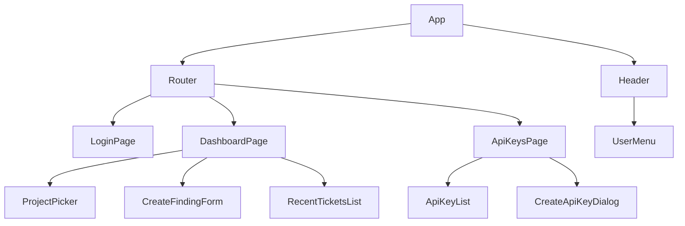
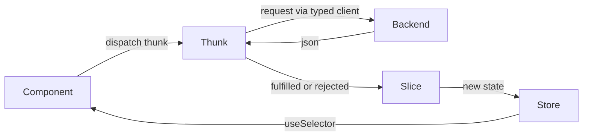

# IdentityHub - Frontend Design Document

The UI for reporting NHI findings as Jira tickets. This document covers the
frontend only. The backend is in [docs/backend-design.md](./backend-design.md).

## Contents

- [Stack](#stack)
- [Responsibilities and non-goals](#responsibilities-and-non-goals)
- [Routes and pages](#routes-and-pages)
- [Component tree](#component-tree)
- [Redux state](#redux-state)
- [Data flow](#data-flow)
- [API calls](#api-calls)
- [Styling](#styling)
- [Product thinking](#product-thinking)

## Stack

- Runtime: the browser. Bun does not run the frontend; it builds it.
- Build: Bun (`bun build`) bundles the React app; Bun also serves it in dev.
- UI: React + TypeScript.
- State: Redux Toolkit (slices + async thunks).
- No Jira token ever reaches this layer. The frontend talks only to our backend
  and holds only an opaque session cookie (set by the backend, HttpOnly, so this
  code cannot even read it).

The frontend lives in the `frontend/` folder, alongside `backend/`.

```
frontend/src/
  pages/        one component per route (LoginPage, DashboardPage, ApiKeysPage).
  components/   shared UI (ProjectPicker, CreateFindingForm, RecentTicketsList).
  store/        Redux store, slices, and async thunks.
  api/          typed Hono RPC client (hc<AppType>).
  main.tsx      entry point.
```

## Responsibilities and non-goals

Does:

- Start login (redirect to the backend), show logged-in state, log out.
- Pick a Jira project, submit the create-finding form.
- Show the 10 most recent app-created tickets for the selected project.
- Manage API keys (create, show once, revoke).

Does not:

- Talk to Atlassian directly.
- Store or see Jira tokens.
- Hold the client secret.

## Routes and pages

| Route                | Page          | Purpose                                     |
| -------------------- | ------------- | ------------------------------------------- |
| `/login`             | LoginPage     | Connect Jira button, starts OAuth           |
| `/`                  | DashboardPage | Project picker, create form, recent tickets |
| `/settings/api-keys` | ApiKeysPage   | Create and revoke API keys                  |

Unauthenticated access to `/` or `/settings` redirects to `/login`.

## Component tree



## Redux state

One store, four slices.

```
authSlice
  status: loggedOut | loggingIn | loggedIn
  user:   { accountId, email } | null
  error:  string | null

projectsSlice
  list:               Project[]
  selectedProjectKey: string | null
  loading:            boolean
  error:              string | null

ticketsSlice
  recentByProjectKey: Record<projectKey, Ticket[]>
  creating:           boolean
  createError:        string | null

apiKeysSlice
  list:            ApiKey[]        // metadata only, never the secret
  newlyCreatedKey: string | null   // shown once, then cleared
  creating:        boolean
  error:           string | null
```

Async thunks: `fetchCurrentUser`, `logout`, `fetchProjects`, `selectProject`,
`createFinding`, `fetchRecentTickets`, `fetchApiKeys`, `createApiKey`,
`revokeApiKey`.

## Data flow



Selecting a project dispatches `selectProject`, which sets
`selectedProjectKey` and triggers `fetchRecentTickets` for that project.
Creating a finding, on success, refreshes the recent tickets for the selected
project so the new ticket appears.

`CreateFindingForm` is built dynamically from the selected project's
`createmeta` (delivered with the project list). It always shows Title and
Description, adds every field the project marks required, and adds a curated set
of important optional fields when the project exposes them (priority, labels,
assignee, due date, components). Text fields render as inputs, enum fields as
dropdowns of their `allowedValues`, labels as a tag input. Required fields must
be filled; optional ones may be left blank. Other optional fields are not shown.

### Draft persistence

The form never loses the user's work. Field values are saved to `localStorage`
as the user types (debounced), keyed per project: `draft:finding:{projectKey}`.

- On mount or project switch, the form restores any saved draft for that project.
- On a successful create, the draft for that project is cleared.
- On a failed create, the draft stays, so the user can fix and retry without
  retyping (especially the description).
- Drafts are cleared on logout, so they do not linger on a shared machine.
- Only form input is stored (title, description, chosen field values). No tokens,
  session, or other secrets ever go to `localStorage`.

## API calls

All calls go through a typed Hono RPC client, `hc<AppType>(baseUrl)` from
`hono/client`, where `AppType` is imported from the backend. Request and response
types are inferred end to end with no codegen and no generated client, so a route
change is a compile error here. The client sends credentials (the session
cookie) with each request. Each thunk wraps one typed call.

| Thunk              | Method and path                 |
| ------------------ | ------------------------------- |
| fetchCurrentUser   | GET /api/me                     |
| logout             | POST /auth/logout               |
| fetchProjects      | GET /api/projects               |
| createFinding      | POST /api/tickets               |
| fetchRecentTickets | GET /api/tickets?projectKey=... |
| fetchApiKeys       | GET /api/api-keys               |
| createApiKey       | POST /api/api-keys              |
| revokeApiKey       | DELETE /api/api-keys/:id        |

A 401 from any call resets `authSlice` to `loggedOut` and redirects to
`/login`, which covers session expiry transparently.

## Styling

CSS Modules, one `.module.css` file per component, imported as typed styles.

- Scoping: each class is local to its component, so names never collide and there
  is no global stylesheet to reason about. This is the safe default for someone
  who does not want to manage CSS specificity by hand.
- Typed classes: a Bun/TypeScript plugin generates types for `styles.x`, so a
  wrong class name is a compile error and editor autocomplete lists the classes.
- Modern syntax: use CSS nesting and CSS custom properties (variables) natively,
  no preprocessor. A single `theme.css` defines design tokens (colors, spacing,
  font sizes, radii) as `:root` custom properties; components reference the
  tokens, so the look is consistent and a change is one edit.
- Dark mode and contrast come free from the tokens via `light-dark()` and a
  `prefers-color-scheme` block, no per-component work.

Responsive:

- Layout uses CSS Grid and Flexbox with `gap`; no fixed pixel widths for
  containers. Content reflows instead of overflowing.
- Fluid sizing with `clamp()` for font sizes and spacing, so text scales between
  a min and max without breakpoints.
- Container queries (`@container`) let components adapt to the space they are
  in, not just the viewport, so the same component works in a sidebar or a wide
  panel.
- A couple of viewport breakpoints handle the big shifts (single column on
  phones, multi column on desktop).

Fast:

- CSS Modules are static: styles are extracted to a plain `.css` file at build
  time, no runtime style engine and no style recalculation cost, unlike CSS-in-JS.
- Critical CSS ships with the bundle; there is no flash of unstyled content.
- No UI framework dependency to download; the token file plus component modules
  keep the CSS small.

## Loading and slow requests

Rate limiting is handled automatically on the backend (`ky` retries honoring
`Retry-After`), so the frontend never shows a rate-limit error. What the frontend
sees is simply a request that takes a little longer, and it makes that pleasant
rather than alarming.

- A slim global top progress bar animates while any request is in flight, so the
  app always feels responsive.
- The create button enters a pending state (spinner, disabled) on submit and
  stays there for the whole call, including any backend retry.
- Progressive reassurance, never an error while still working: if the call runs
  longer than a couple of seconds (backend is retrying), the button label
  softens to "Still creating..." instead of failing. No scary message appears
  while the request is pending.
- Data fetches (projects, recent tickets) show skeleton placeholders, not
  spinners on blank screens, so layout does not jump when data arrives.
- Only if the backend finally gives up (retries exhausted) does a calm,
  actionable message appear ("Jira is busy, please try again"), with the form
  still filled for a one-click retry.

## Form validation

Validation runs in two places with the same limits (from the backend config, so
they never drift): live in the UI for feedback, and authoritatively on the
backend for safety.

Real-time UI validation:

- Validates as the user types (debounced), not only on submit.
- Elegant, colored feedback: a field is neutral until touched, turns a calm
  success color when valid, and a clear error color when invalid, with the
  message directly under the field.
- Title: required, non-empty after trim, max 255 characters. A live character
  counter (for example `240 / 255`) turns amber as it nears the limit and red
  when exceeded.
- Description: max length shown the same way with a counter.
- Required per-project fields (from createmeta) are marked with a required
  indicator and validated the same way.
- The submit button is disabled until the whole form is valid, and shows why it
  is disabled (a short summary) so the user is never stuck without knowing what
  is missing.
- Messages are specific and kind: "Title is required", "Title must be 255
  characters or fewer (currently 268)", not "invalid".

## Error taxonomy

Every error is classified so the message says what happened, whose fault it is,
and what to do next. The UI never shows a raw status code or JSON.

| Case | Class | Message and behavior |
|------|-------|----------------------|
| Field invalid (length, required) | Your input | Inline, per field, live. Submit stays disabled. |
| Missing project-required field | Your input | Name the field: "Severity is required for this project." |
| Session expired (401) | Auto-recovered | No error shown. Silent redirect to re-login (see API calls). |
| No permission / project gone (403/404) | Rare race | Should not happen (picker only lists creatable projects). If it does: "That project is no longer available", and refresh the project list. |
| Jira rate limited (429) | System, auto | No error shown. Backend retries; UI shows the slow-request loading. |
| Jira or network failed (502) | System, retry | "We couldn't reach Jira. Your finding was not created, please try again." Form stays filled. |
| Unexpected (500) | System | "Something went wrong on our side. Please try again." with a request id for support. |

The split is deliberate: "your input" errors are fixable by the user and are
shown inline and immediately; "system" errors are not the user's fault and offer
a retry with their work preserved; some cases are handled automatically and show
no error at all.

## Intuitive interactions

- Loading states: skeletons while fetching projects and tickets; submit button
  disabled with a spinner while creating. Never a frozen-looking screen.
- Empty states: "No findings reported for this project yet" with a nudge to
  create one, not a blank area.
- Success feedback: after creating a ticket, a toast with the issue key and a
  direct link ("Created NHI-7 ->").
- Do not lose the user's work: on a failed create the form stays filled (also
  persisted to localStorage, see Draft persistence); the description is never
  wiped.
- Prevent double-submit: the button is disabled while pending so a slow network
  cannot create duplicate tickets.
- Recent tickets: clickable, open the Jira issue in a new tab (`target="_blank"`
  with `rel="noopener"`), showing title and relative time ("2 hours ago").
- Project picker: searchable, and only lists projects the user can create in
  (from createmeta), so there are no dead options.
- API key UX: shown exactly once with a copy button and an explicit "you will not
  see this again" warning; revoke asks for confirmation (destructive action).
- Show context: the header shows which Jira site or workspace the user is
  connected to and who they are logged in as. Because the app is multi-tenant,
  the user must never be unsure whose Jira they are filing into.
- First-run guidance: a logged-in-but-nothing-yet state that explains the next
  step (pick a project, create a finding).

## Product-thinking through-line

Two things are the strongest evidence of product thinking, and the design leans
on both:

1. The error taxonomy above clearly separates user-fixable input errors from
   system or Jira errors, and words each one specifically. This is the most
   visible signal that the end-user experience was considered.
2. The unhappy paths are designed, not just the happy path: expired session, no
   permission, rate limiting, empty project, and failed create each have a
   defined behavior, so the app feels considered even when things go wrong.
